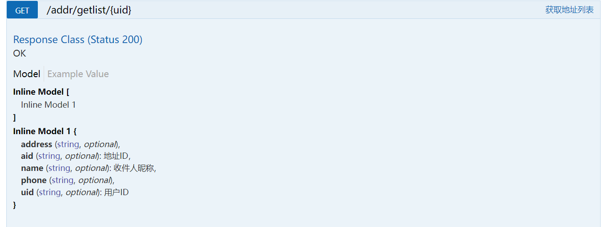

# Swagger基础配置

```java
package com.example.databasebigwork.config;

import org.springframework.context.annotation.Bean;
import org.springframework.context.annotation.Configuration;
import springfox.documentation.builders.ApiInfoBuilder;
import springfox.documentation.service.ApiInfo;
import springfox.documentation.service.Contact;
import springfox.documentation.service.VendorExtension;
import springfox.documentation.spi.DocumentationType;
import springfox.documentation.spring.web.plugins.Docket;
import springfox.documentation.swagger2.annotations.EnableSwagger2;

import java.util.ArrayList;

@Configuration
@EnableSwagger2 //  启用Swagger
public class SwaggerConfig {
    /**
     * 配置swagger的核心对象
     * @return Docket
     */
    @Bean
    public Docket docket(){
        return new Docket(DocumentationType.SWAGGER_2)
                .apiInfo(apiInfo());
    }

    /**
     * 获取Swagger页面信息
     * @return ApiInfo
     */
    private ApiInfo apiInfo(){
        // 作者信息
        Contact contact = new Contact("iris", "http://www.baidu.com", "1351705036@qq.com");
        return new ApiInfo("iris's Api Documentation",
                "A little project's Api Documentation",
                "v1.0",
                "http://www.bing.com",
                contact,
                "Apache 2.0",
                "http://www.apache.org/licenses/LICENSE-2.0",
                new ArrayList<VendorExtension>());
    }
}

```

Docket是Swagger的主要实例。

基本上所有功能都在Docket实例实现。

# 自定义扫描包

```java
/**
     * 配置swagger的核心对象
     * @return Docket
     */
@Bean
public Docket docket(){
    return new Docket(DocumentationType.SWAGGER_2)
        .apiInfo(apiInfo()) 
        .enable(false) // 是否使用swagger
        .select() // 设置扫描器
        .apis(RequestHandlerSelectors.basePackage("com.example.databasebigwork.controller")) // 设置包扫描规则
        .paths(PathSelectors.any()) // 过滤规则
        .build();
}
```


# API注解

在对应方法/类的文档位置加注释。

```java
@RestController
@RequestMapping("/addr")
public class AddressController {

    @Autowired
    AddressService addressService;

    @ApiOperation("获取地址列表")
    @GetMapping("/getlist/{uid}")
    public ArrayList<UserAddress> getList(@ApiParam("用户ID")@PathVariable("uid")String uid){
        return addressService.getList(uid);
    }
}

```




文档API注解都以API开头。

# 注意：

在正式发布时关闭swagger功能。


