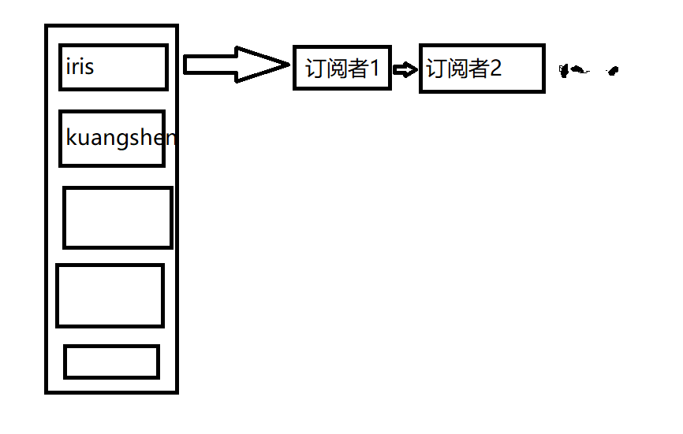
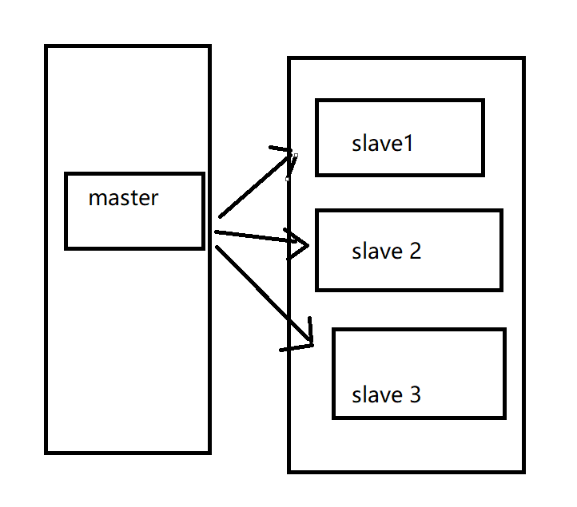
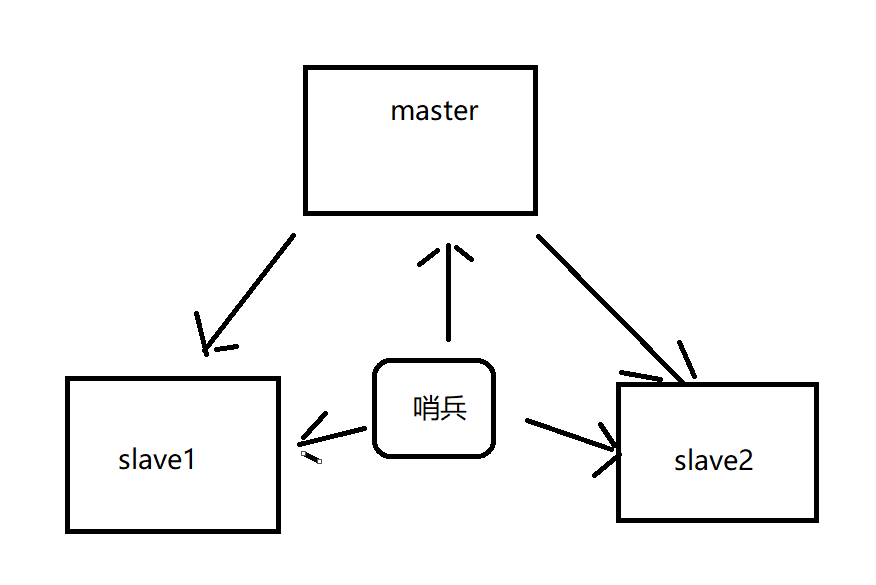

# 订阅发布

redis有API实现

源码在subscribe.c文件 有兴趣可看

```bash
# 订阅频道
subscribe <频道> 

# 发布消息
publish <频道> <message>
```


## 原理

服务器维护被订阅者们的字典。

在被订阅端维护订阅者的链表。

发送者接收消息发送给所有人。



# 主从复制，读写分离

将Master节点复制到Slave节点。



主从复制，读写分离。80%的读操作分担给所有节点。20%的写操作分担给master节点。一主二从。

单台redis不要超过20G。

## 环境配置

只配置从库，不配置主库。（redis默认为主库。

```bash
# 查看当前库信息
127.0.0.1:6379> info replication
# Replication
role:master
connected_slaves:0
master_failover_state:no-failover
master_replid:9f182f4ef9aef03cd4560582b333d3411b2ee917
master_replid2:0000000000000000000000000000000000000000
master_repl_offset:0
second_repl_offset:-1
repl_backlog_active:0
repl_backlog_size:1048576
repl_backlog_first_byte_offset:0
repl_backlog_histlen:0
```

单机多端口模拟

修改config的。

> ip
>
> logfile
>
> pidfile
>
> rdb file

```bash
# 启动3台redis。
root       1506      1  0 03:11 ?        00:00:00 redis-server 127.0.0.1:6379
root       1513      1  0 03:12 ?        00:00:00 redis-server 127.0.0.1:6380
root       1522      1  0 03:12 ?        00:00:00 redis-server 127.0.0.1:6381
```

## 一主二从

一般只配置从机。

配置从机。指定主机就好。(认老大)

```bash
#从机
127.0.0.1:6380> SLAVEOF 127.0.0.1 6379
OK
127.0.0.1:6380> info replication
# Replication
role:slave  # 角色 从机
master_host:127.0.0.1 # 主机信息
master_port:6379
master_link_status:up
master_last_io_seconds_ago:9
master_sync_in_progress:0
slave_read_repl_offset:28
slave_repl_offset:28
slave_priority:100
slave_read_only:1
replica_announced:1
connected_slaves:0
master_failover_state:no-failover
master_replid:59f020c6cbef4a12ec5ad5a52a7d19adbeb97d35
master_replid2:0000000000000000000000000000000000000000
master_repl_offset:28
second_repl_offset:-1
repl_backlog_active:1
repl_backlog_size:1048576
repl_backlog_first_byte_offset:1
repl_backlog_histlen:28
```

```bash
#主机
127.0.0.1:6379> info replication
# Replication
role:master
connected_slaves:1
slave0:ip=127.0.0.1,port=6380,state=online,offset=210,lag=0
master_failover_state:no-failover
master_replid:59f020c6cbef4a12ec5ad5a52a7d19adbeb97d35
master_replid2:0000000000000000000000000000000000000000
master_repl_offset:210
second_repl_offset:-1
repl_backlog_active:1
repl_backlog_size:1048576
repl_backlog_first_byte_offset:1
repl_backlog_histlen:210
```

真实的主从复制是在配置文件中定义的。

在REPLICATION一栏中的 replicaof属性配置

``` txt
################################# REPLICATION #################################

# Master-Replica replication. Use replicaof to make a Redis instance a copy of
# another Redis server. A few things to understand ASAP about Redis replication.
#
#   +------------------+      +---------------+
#   |      Master      | ---> |    Replica    |
#   | (receive writes) |      |  (exact copy) |
#   +------------------+      +---------------+
#
# 1) Redis replication is asynchronous, but you can configure a master to
#    stop accepting writes if it appears to be not connected with at least
#    a given number of replicas.
# 2) Redis replicas are able to perform a partial resynchronization with the
#    master if the replication link is lost for a relatively small amount of
#    time. You may want to configure the replication backlog size (see the next
#    sections of this file) with a sensible value depending on your needs.
# 3) Replication is automatic and does not need user intervention. After a
#    network partition replicas automatically try to reconnect to masters
#    and resynchronize with them.
#
# replicaof <masterip> <masterport>  配置这个
```

## 只能在主机写

```bash
# 主机
127.0.0.1:6379> keys *
(empty array)
127.0.0.1:6379> mset k1 v1 k2 v2
OK

# 从机
127.0.0.1:6380> keys *
1) "k2"
2) "k1"
127.0.0.1:6380> set k3 v3
(error) READONLY You can't write against a read only replica.
```

## 问题

主机掉线，从机依然连接主机。但是没有写操作。

主机重连，可以正常运行。

``` bash
# 主机掉线
127.0.0.1:6380> info replication
# Replication
role:slave # 还是从机(没有写操作)
master_host:127.0.0.1 # 主机不变
master_port:6379
master_link_status:down # 主机掉线
master_last_io_seconds_ago:-1
master_sync_in_progress:0
slave_read_repl_offset:979
slave_repl_offset:979
master_link_down_since_seconds:7
slave_priority:100
slave_read_only:1
replica_announced:1
connected_slaves:0
master_failover_state:no-failover
master_replid:59f020c6cbef4a12ec5ad5a52a7d19adbeb97d35
master_replid2:0000000000000000000000000000000000000000
master_repl_offset:979
second_repl_offset:-1
repl_backlog_active:1
repl_backlog_size:1048576
repl_backlog_first_byte_offset:1
repl_backlog_histlen:979
```

没有配置(配置文件)的从机redis重启后会默认主机。

变为主机后，可以获得主机的数据。

### 复制原理

全量复制：

> 将主机的所有数据全部复制。
> 在从机第一次连接时发生。

增量复制：

> 将主机中多的，复制到从机。
>
> 连接后，使用增量复制。

### 链式集群(链式主从)(层层链路)


中间节点依然是从节点。

主机掉了使用 slaveof no one取消中间从机的从机半连接。

将剩下的服务器作为新的集群。中间从机作为主机。

> 哨兵模式以前就是这个模式。(手动执行)
>
> 谋朝篡位:
>
> > 原主机重连，只能重新配置。


# 哨兵模式(自动选举主机)



哨兵是一个独立进程。对服务器监控。

一般哨兵还要配置集群，以免哨兵挂掉。

## 一主二从测试

### 配置哨兵 配置文件sentinel.conf

```bash
# sentinel monitor 监控主机名称 ip  port  是否投票给该主机
sentinel monitor myredis 127.0.0.1 6379 1
```

### 启动哨兵

```bash
[root@CentOS7 bin]# redis-sentinel config/sentinel.conf 
3801:X 16 Aug 2022 03:53:02.357 # oO0OoO0OoO0Oo Redis is starting oO0OoO0OoO0Oo
3801:X 16 Aug 2022 03:53:02.357 # Redis version=7.0.4, bits=64, commit=00000000, modified=0, pid=3801, just started
3801:X 16 Aug 2022 03:53:02.357 # Configuration loaded
3801:X 16 Aug 2022 03:53:02.357 * Increased maximum number of open files to 10032 (it was originally set to 1024).
3801:X 16 Aug 2022 03:53:02.357 * monotonic clock: POSIX clock_gettime
                _._                                                  
           _.-``__ ''-._                                             
      _.-``    `.  `_.  ''-._           Redis 7.0.4 (00000000/0) 64 bit
  .-`` .-```.  ```\/    _.,_ ''-._                                  
 (    '      ,       .-`  | `,    )     Running in sentinel mode
 |`-._`-...-` __...-.``-._|'` _.-'|     Port: 26379
 |    `-._   `._    /     _.-'    |     PID: 3801
  `-._    `-._  `-./  _.-'    _.-'                                   
 |`-._`-._    `-.__.-'    _.-'_.-'|                                  
 |    `-._`-._        _.-'_.-'    |           https://redis.io       
  `-._    `-._`-.__.-'_.-'    _.-'                                   
 |`-._`-._    `-.__.-'    _.-'_.-'|                                  
 |    `-._`-._        _.-'_.-'    |                                  
  `-._    `-._`-.__.-'_.-'    _.-'                                   
      `-._    `-.__.-'    _.-'                                       
          `-._        _.-'                                           
              `-.__.-'                                               

3801:X 16 Aug 2022 03:53:02.358 # WARNING: The TCP backlog setting of 511 cannot be enforced because /proc/sys/net/core/somaxconn is set to the lower value of 128.
3801:X 16 Aug 2022 03:53:02.360 * Sentinel new configuration saved on disk
3801:X 16 Aug 2022 03:53:02.360 # Sentinel ID is 191880b6071d9f7c52444181013a62e0b824cab3
3801:X 16 Aug 2022 03:53:02.360 # +monitor master myredis 127.0.0.1 6379 quorum 1
3801:X 16 Aug 2022 03:53:02.360 * +slave slave 127.0.0.1:6380 127.0.0.1 6380 @ myredis 127.0.0.1 6379
3801:X 16 Aug 2022 03:53:02.362 * Sentinel new configuration saved on disk
3801:X 16 Aug 2022 03:53:02.362 * +slave slave 127.0.0.1:6381 127.0.0.1 6381 @ myredis 127.0.0.1 6379
3801:X 16 Aug 2022 03:53:02.364 * Sentinel new configuration saved on disk
```

### 主机下线

```bash
3801:X 16 Aug 2022 03:54:34.033 # +sdown master myredis 127.0.0.1 6379
3801:X 16 Aug 2022 03:54:34.033 # +odown master myredis 127.0.0.1 6379 #quorum 1/1
3801:X 16 Aug 2022 03:54:34.033 # +new-epoch 1
3801:X 16 Aug 2022 03:54:34.033 # +try-failover master myredis 127.0.0.1 6379
3801:X 16 Aug 2022 03:54:34.035 * Sentinel new configuration saved on disk
3801:X 16 Aug 2022 03:54:34.035 # +vote-for-leader 191880b6071d9f7c52444181013a62e0b824cab3 1
3801:X 16 Aug 2022 03:54:34.035 # +elected-leader master myredis 127.0.0.1 6379
3801:X 16 Aug 2022 03:54:34.035 # +failover-state-select-slave master myredis 127.0.0.1 6379
3801:X 16 Aug 2022 03:54:34.106 # +selected-slave slave 127.0.0.1:6380 127.0.0.1 6380 @ myredis 127.0.0.1 6379
3801:X 16 Aug 2022 03:54:34.107 * +failover-state-send-slaveof-noone slave 127.0.0.1:6380 127.0.0.1 6380 @ myredis 127.0.0.1 6379
3801:X 16 Aug 2022 03:54:34.192 * +failover-state-wait-promotion slave 127.0.0.1:6380 127.0.0.1 6380 @ myredis 127.0.0.1 6379
3801:X 16 Aug 2022 03:54:34.470 * Sentinel new configuration saved on disk
3801:X 16 Aug 2022 03:54:34.470 # +promoted-slave slave 127.0.0.1:6380 127.0.0.1 6380 @ myredis 127.0.0.1 6379
3801:X 16 Aug 2022 03:54:34.470 # +failover-state-reconf-slaves master myredis 127.0.0.1 6379
3801:X 16 Aug 2022 03:54:34.474 * +slave-reconf-sent slave 127.0.0.1:6381 127.0.0.1 6381 @ myredis 127.0.0.1 6379
3801:X 16 Aug 2022 03:54:35.514 * +slave-reconf-inprog slave 127.0.0.1:6381 127.0.0.1 6381 @ myredis 127.0.0.1 6379
3801:X 16 Aug 2022 03:54:35.514 * +slave-reconf-done slave 127.0.0.1:6381 127.0.0.1 6381 @ myredis 127.0.0.1 6379
3801:X 16 Aug 2022 03:54:35.590 # +failover-end master myredis 127.0.0.1 6379
3801:X 16 Aug 2022 03:54:35.590 # +switch-master myredis 127.0.0.1 6379 127.0.0.1 6380
3801:X 16 Aug 2022 03:54:35.590 * +slave slave 127.0.0.1:6381 127.0.0.1 6381 @ myredis 127.0.0.1 6380
3801:X 16 Aug 2022 03:54:35.590 * +slave slave 127.0.0.1:6379 127.0.0.1 6379 @ myredis 127.0.0.1 6380
3801:X 16 Aug 2022 03:54:35.592 * Sentinel new configuration saved on disk
```

### 选举新主机

```bash
127.0.0.1:6380> info replication
# Replication
role:master
connected_slaves:1
slave0:ip=127.0.0.1,port=6381,state=online,offset=11691,lag=1
master_failover_state:no-failover
master_replid:6bef0752a1ee3680a7e60d372bd7c56323649ee2
master_replid2:d0885786c3ea57f3a7fd35ac9eb83d0a0f529389
master_repl_offset:11691
second_repl_offset:6951
repl_backlog_active:1
repl_backlog_size:1048576
repl_backlog_first_byte_offset:1862
repl_backlog_histlen:9830
```

### 主机上线，也只能当从机

```bash
127.0.0.1:6380> info replication
# Replication
role:master
connected_slaves:2
slave0:ip=127.0.0.1,port=6381,state=online,offset=24124,lag=0
slave1:ip=127.0.0.1,port=6379,state=online,offset=24124,lag=0
master_failover_state:no-failover
master_replid:6bef0752a1ee3680a7e60d372bd7c56323649ee2
master_replid2:d0885786c3ea57f3a7fd35ac9eb83d0a0f529389
master_repl_offset:24124
second_repl_offset:6951
repl_backlog_active:1
repl_backlog_size:1048576
repl_backlog_first_byte_offset:1862
repl_backlog_histlen:22263
```

## 总结优缺点

优点

1. 基于主从复制模式，所有主从优点都有。
2. 主从可以切换，故障可以转移。
3. 主从模式升级，更加健壮

缺点

1. 不好扩容，集群到上限，在线扩容就很麻烦。
2. 配置很麻烦。

> 全部配置
>
> \# Example sentinel.conf
>
> \# *** IMPORTANT ***
> \# 绑定IP地址
> \# bind 127.0.0.1 192.168.1.1
> \# 保护模式（是否禁止外部链接，除绑定的ip地址外）
> \# protected-mode no
>
> \# port <sentinel-port>
> \# 此Sentinel实例运行的端口
> port 26379
>
> \# 默认情况下，Redis Sentinel不作为守护程序运行。 如果需要，可以设置为 yes。
> daemonize no
>
> \# 启用守护进程运行后，Redis将在F{0XCAB)LKNIT0K@G.gif)ar/run/redis-sentinel.pid中写入一个pid文件
> pidfile F{0XCAB)LKNIT0K@G.gif)ar/run/redis-sentinel.pid
>
> \# 指定日志文件名。 如果值为空，将强制Sentinel日志标准输出。守护进程下，如果使用标准输出进行日志记录，则日志将发送到/dev/null
> logfile ""
>
> \# sentinel announce-ip <ip>
> \# sentinel announce-port <port>
> \#
> \# 上述两个配置指令在环境中非常有用，因为NAT可以通过非本地地址从外部访问Sentinel。
> \#
> \# 当提供announce-ip时，Sentinel将在通信中声明指定的IP地址，而不是像通常那样自动检测本地地址。
> \#
> \# 类似地，当提供announce-port 有效且非零时，Sentinel将宣布指定的TCP端口。
> \#
> \# 这两个选项不需要一起使用，如果只提供announce-ip，Sentinel将宣告指定的IP和“port”选项指定的服务器端口。
> \# 如果仅提供announce-port，Sentinel将通告自动检测到的本地IP和指定端口。
> \#
> \# Example:
> \#
> \# sentinel announce-ip 1.2.3.4
>
> \# dir <working-directory>
> \# 每个长时间运行的进程都应该有一个明确定义的工作目录。对于Redis Sentinel来说，/tmp就是自己的工作目录。
> dir /tmp
>
> \# sentinel monitor <master-name> <ip> <redis-port> <quorum>
> \#
> \# 告诉Sentinel监听指定主节点，并且只有在至少<quorum>哨兵达成一致的情况下才会判断它 O_DOWN 状态。
> \#
> \#
> \# 副本是自动发现的，因此您无需指定副本。
> \# Sentinel本身将重写此配置文件，使用其他配置选项添加副本。另请注意，当副本升级为主副本时，将重写配置文件。
> \#
> \# 注意：主节点（master）名称不能包含特殊字符或空格。
> \# 有效字符可以是 A-z 0-9 和这三个字符 ".-_".
> sentinel monitor mymaster 127.0.0.1 6379 2
>
> \# 如果redis配置了密码，那这里必须配置认证，否则不能自动切换
> \# Example:
> \#
> \# sentinel auth-pass mymaster MySUPER--secret-0123passw0rd
>
> \# sentinel down-after-milliseconds <master-name> <milliseconds>
> \#
> \# 主节点或副本在指定时间内没有回复PING，便认为该节点为主观下线 S_DOWN 状态。
> \#
> \# 默认是30秒
> sentinel down-after-milliseconds mymaster 30000
>
> \# sentinel parallel-syncs <master-name> <numreplicas>
> \#
> \# 在故障转移期间，多少个副本节点进行数据同步
> sentinel parallel-syncs mymaster 1
>
> \# sentinel failover-timeout <master-name> <milliseconds>
> \#
> \# 指定故障转移超时（以毫秒为单位）。 它以多种方式使用：
> \#
> \# - 在先前的故障转移之后重新启动故障转移所需的时间已由给定的Sentinel针对同一主服务器尝试，是故障转移超时的两倍。
> \#
> \# - 当一个slave从一个错误的master那里同步数据开始计算时间。直到slave被纠正为向正确的master那里同步数据时。
> \#
> \# - 取消已在进行但未生成任何配置更改的故障转移所需的时间
> \#
> \# - 当进行failover时，配置所有slaves指向新的master所需的最大时间。
> \#  即使过了这个超时，slaves依然会被正确配置为指向master。
> \#
> \# 默认3分钟
> sentinel failover-timeout mymaster 180000
>
> \# 脚本执行
> \#
> \# sentinel notification-script和sentinel reconfig-script用于配置调用的脚本，以通知系统管理员或在故障转移后重新配置客户端。
> \# 脚本使用以下规则执行以进行错误处理：
> \#
> \# 如果脚本以“1”退出，则稍后重试执行（最多重试次数为当前设置的10次）。
> \#
> \# 如果脚本以“2”（或更高的值）退出，则不会重试执行。
> \#
> \# 如果脚本因为收到信号而终止，则行为与退出代码1相同。
> \#
> \# 脚本的最长运行时间为60秒。 达到此限制后，脚本将以SIGKILL终止，并重试执行。
>
> \# 通知脚本
> \#
> \# sentinel notification-script <master-name> <script-path>
> \#
> \# 为警告级别生成的任何Sentinel事件调用指定的通知脚本（例如-sdown，-odown等）。
> \# 此脚本应通过电子邮件，SMS或任何其他消息传递系统通知系统管理员 监控的Redis系统出了问题。
> \#
> \# 使用两个参数调用脚本：第一个是事件类型，第二个是事件描述。
> \#
> \# 该脚本必须存在且可执行，以便在提供此选项时启动sentinel。
> \#
> \# 举例:
> \#
> \# sentinel notification-script mymaster F{0XCAB)LKNIT0K@G.gif)ar/redisT67M.gif)tify.sh
>
> \# 客户重新配置脚本
> \#
> \# sentinel client-reconfig-script <master-name> <script-path>
> \#
> \# 当主服务器因故障转移而变更时，可以调用脚本执行特定于应用程序的任务，以通知客户端，配置已更改且主服务器地址已经变更。
> \#
> \# 以下参数将传递给脚本：
> \#
> \# <master-name> <role> <state> <from-ip> <from-port> <to-ip> <to-port>
> \#
> \# <state> 目前始终是故障转移 "failover"
> \# <role> 是 "leader" 或 "observer"
> \#
> \# 参数 from-ip, from-port, to-ip, to-port 用于传递主服务器的旧地址和所选副本的新地址。
> \#
> \# 举例:
> \#
> \# sentinel client-reconfig-script mymaster F{0XCAB)LKNIT0K@G.gif)ar/redis/reconfig.sh
>
> \# 安全
> \# 避免脚本重置，默认值yes
> \# 默认情况下，SENTINEL SET将无法在运行时更改notification-script和client-reconfig-script。
> \# 这避免了一个简单的安全问题，客户端可以将脚本设置为任何内容并触发故障转移以便执行程序。
> sentinel deny-scripts-reconfig yes
>
> \# REDIS命令重命名
> \#
> \#
> \# 在这种情况下，可以告诉Sentinel使用不同的命令名称而不是正常的命令名称。
> \# 例如，如果主“mymaster”和相关副本的“CONFIG”全部重命名为“GUESSME”，我可以使用：
>
> \# SENTINEL rename-command mymaster CONFIG GUESSME
>
> \# 设置此类配置后，每次Sentinel使用CONFIG时，它将使用GUESSME。 请注意，实际上不需要尊重命令案例，因此在上面的示例中写“config guessme”是相同的。
>
> \# SENTINEL SET也可用于在运行时执行此配置。
>
> \# 为了将命令设置回其原始名称（撤消重命名），可以将命令重命名为它自身：
>
> \# SENTINEL rename-command mymaster CONFIG CONFIG


初级中级程序员饱和。高级程序员缺少。
