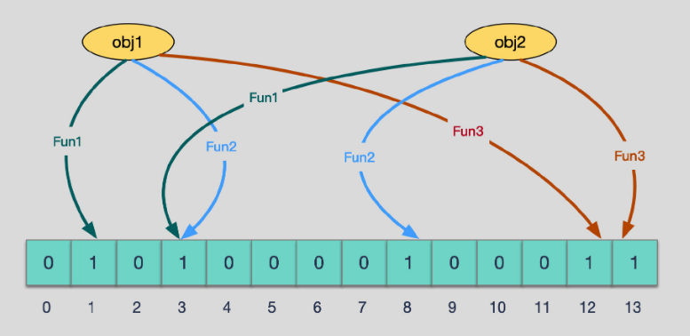

# 缓存穿透

## 缓存穿透

太多请求没有在redis中获取，会直接落到数据库上，造成数据库压力增大。

### 解决方案

#### 布隆过滤器

给M位的bitmap，通过多个函数，将对象的hash映射到不同的位上。并置为1。

在查询过程中，若查询的对象的hash所对应的位不都为1，则必定不存在。

全为1不一定存在，不全为1一定不存在。

因为删除时，bit是共享的。所以无法删除。

#### 缓存空对象

将查不到的key缓存在缓存中。查询时返回空对象。

## 缓存击穿

一个点承受的并发过于庞大。在缓存失效到恢复的短时间内，压力会直接给到数据库。

### 解决方案

#### 同步锁

在击穿到数据库时，只允许一个进程访问数据库。其他等待。

#### 热点永不过期

将热点一直存储在缓存中。

# 雪崩

redis集群集体下线或者崩溃。

## 解决方案

### 异地多活

### 服务降级

### 数据预热